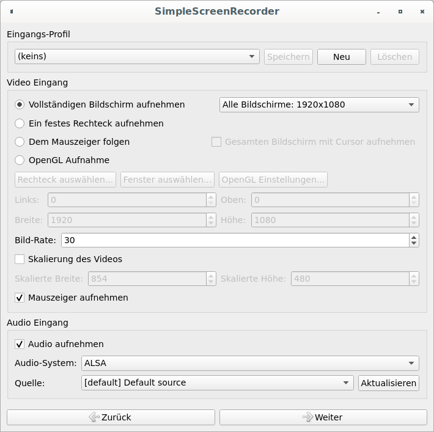
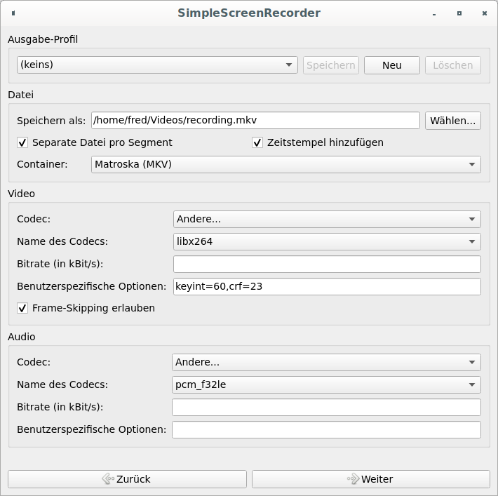

# Schulungen aufzeichnen

## Warum interne Schulungen aufnehmen?

* Zum Nachholen für verhinderte Kollegen
* Selbständige Einarbeitung von Junioren
* Möglichkeit zur Selbstreflexion
* Vorbereitung zukünftiger Durchgänge
* Potenzielles Werbemittel für die Firma

## Checkliste

[Northwest Airlines Flight 255](https://www.reddit.com/r/CatastrophicFailure/comments/97s74i)

1. Durchgängiges Bild sicherstellen
   - Stromversorgung überprüfen
   - Energie-Optionen anpassen
   - Bildschirmschoner deaktivieren
2. Inkognito bleiben
   - Browser-Chronik löschen
   - Outlook schließen
   - Desktop aufräumen
3. Audio & Video
   - Eingangspegel regulieren
   - Beamer anschließen
   - Anzeige duplizieren

## Best practices

* Mit dem Laptop reden, nicht mit der Leinwand
* Spontane Diagramme möglichst am Rechner malen
* Tafelbilder laut und ausführlich erläutern
* In großen Sälen: Fragen knapp wiederholen

## mplayer

### Installation

```
sudo apt install mplayer
```

### Webcam einblenden

```
mplayer tv:// -tv driver=v4l2:width=320:height=180 -vf mirror -vo xv -geometry 100%:100% -noborder -ontop
```

## SimpleScreenRecorder

### Installation

SimpleScreenRecorder liegt seit Mitte 2017 in den offiziellen Debian-Repositories:

* Debian
  * Ubuntu
    * Linux Mint
  * Linux Mint Debian Edition

```
sudo apt install simplescreenrecorder
```

Auf beiden Linux Mint Varianten empfiehlt es sich, proprietäre Codecs zu installieren:
```
sudo apt install mint-meta-codecs
```

Falls die Standard-Software des Betriebssystems das aufgezeichnete Video nicht abspielen kann, VLC installieren:
```
sudo apt install vlc
```

### Konfiguration





## Schnitt

```
sudo apt install ffmpeg
```

Grafisches ffmpeg-Frontend für verlustfreien Schnitt:

https://github.com/mifi/lossless-cut#download

Alternativ per Konsole schneiden, siehe nächste 4 Abschnitte

https://superuser.com/questions/138331

### Ende abschneiden

```
ffmpeg -i input.mkv -c copy -t 01:02:03.0 output.mkv
```

### Anfang und Ende abschneiden

```
ffmpeg -ss 00:01:23.0 -i input.mkv -c copy -to 01:02:03.0 output.mkv
```

Den Anfang sollte man möglichst an einem Keyframe abschneiden, um sich unnötigen Software-Ärger zu ersparen.

### Keyframes identifizieren

https://stackoverflow.com/questions/18085458

Die Zeitstempel von Keyframes kann `ffprobe` ermitteln:

```
ffprobe -loglevel error -skip_frame nokey -select_streams v:0 -show_entries frame=pkt_pts_time -of csv=print_section=0 input.mkv
```

### Zusammenfügen

https://stackoverflow.com/questions/42859528

```
ffmpeg -f concat -i inputs.txt -c copy output.mkv
```
inputs.txt
```
file a.mkv
file b.mkv
file c.mkv
```

## Audio postprocessing

```
sudo apt install audacity
```

Eingabe in Video und Audio auftrennen:
```
ffmpeg -i input.mkv -map 0:v -c:v copy video.mkv -map 0:a -c:a copy noisy.wav
```

Mit vorherigem Schritt "Zusammenfügen" kombinieren:
```
ffmpeg -f concat -i inputs.txt -map 0:v -c:v copy video.mkv -map 0:a -c:a copy noisy.wav
```

Rauschen und Tastatur-Wummern entfernen:
* `noisy.wav` in Audacity öffnen
* Ein paar Sekunden rauschender Stille markieren
  * Notfalls frische Stille separat aufnehmen
* Effekt / Rausch-Verminderung...
  * Rauschprofil ermitteln
* Alles markieren
* Effekt / Rausch-Verminderung...
  * Rauschverminderung (db): 12
  * Empfindlichkeit: 6,00
  * Frequenz-Glättung (Bänder): 3
  * Rauschen: (*) Vermindern
  * OK
* Effekt / Kerbfilter...
  * Frequenz (Hz): 60,0
  * Q: 2,0
* Datei / Exportieren / Als WAV exportieren
  * Name: `clean.wav`
  * Speichern
  * OK

Bereinigtes Audio komprimieren und mit Video zusammenführen:
```
ffmpeg -i video.mkv -i clean.wav -c:v copy -c:a aac output.mp4
```

## YouTube

YouTube unterscheidet drei Sichtbarkeitsstufen:

* Öffentlich
* Nicht gelistet
* Privat

Interne Schulungen sollte man ungelistet hochladen und die Video-Links den Interessierten zur Verfügung stellen.
(Ohne Link sind ungelistete Videos auf YouTube nicht auffindbar.)
